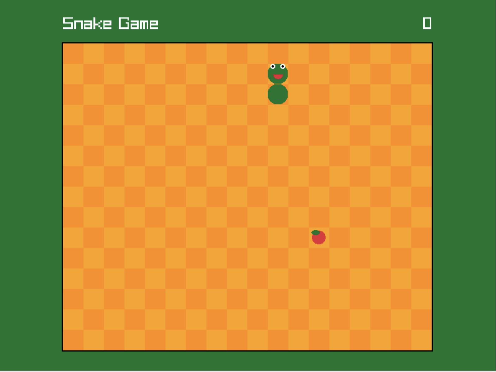
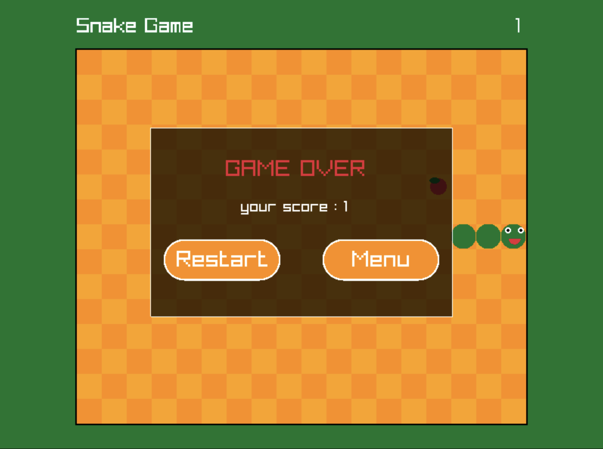
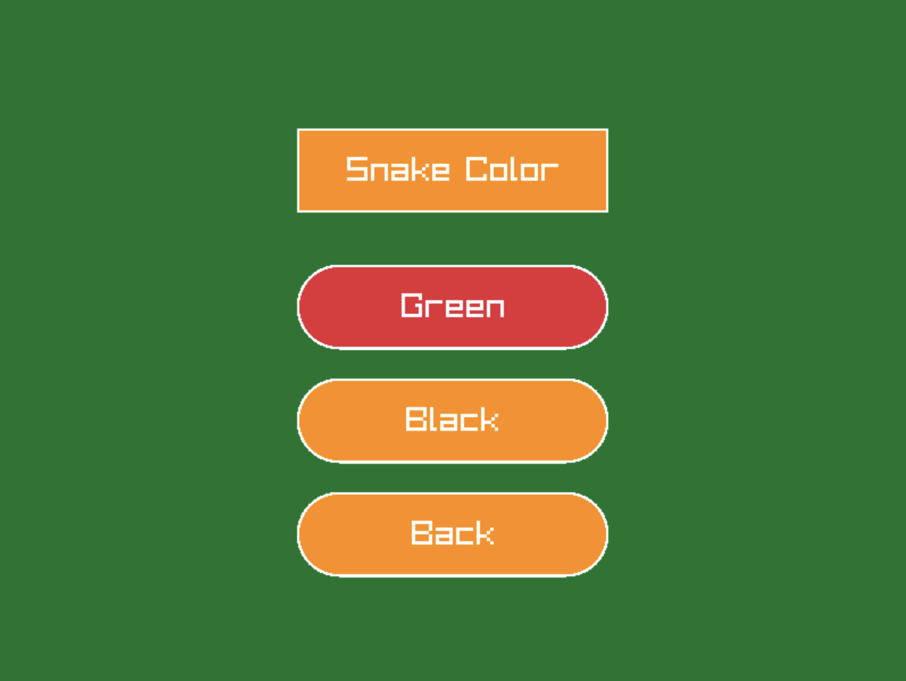

 # 📚 About This Project

This project was originally developed as part of a university assignment at the University of the West of England (UWE) 🏫 and is now shared as part of my personal portfolio and resume.

🛠️ It's here to showcase my work and to help others learn — you're welcome to explore the structure, coding style, and problem-solving approach for educational purposes.

🧩 Note: The browser HTML and CSS template was provided by the university. I was responsible only for the game creation and core logic development.

🚫 Please don’t copy or submit it as your own — that would go against academic integrity policies and could be considered plagiarism.

👍 Feel free to use it for inspiration, learn from it, and use what you learn to build something even better!

<br>
<br>
 
 # 🎮 POP Raylib Game

🧩 Simple starter application for  C assignment

## 📸 Screenshots:

### 🏠 Main Menu


### 🕹️ Gameplay


### ❌ Game Over Menu


### ⚙️ Options 



# 🛠️ Building

To build run the command:

```bash
/opt/pop/bin/build-wasm.sh src/main.c
```

📁 This will generate a directory *out* with the WASM and index.html files for the 
Raylib program.

# 🚀 Running

The very first time you run a POP WASM application you must run the command:

```bash
/opt/pop/bin/allocate_port.sh
```

💡 You might need to start a new terminal instance for the update to take effect.
To check that everything is fine run the command:

```bash
echo $MY_PORT
```

🔢 This should output a 5 digit number.


To run the Raylib program in *out* simply run the command:

```bash
/opt/pop/bin/run-wasm.sh
```

🌐 This will run a web server that serves the *out* on the port you allocated above. This is forwarded from the 
remote server to your local machine, which means you can simply open the corresponding web page within a browser 
on your local machine using the address:

```bash
localhost:XXXXX
```

🧭 where *XXXXX* is the port number you allocated above.
